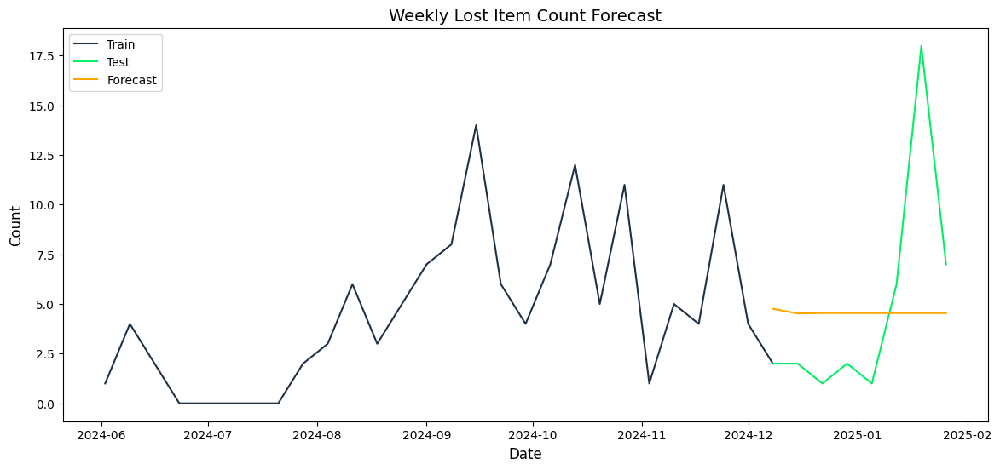
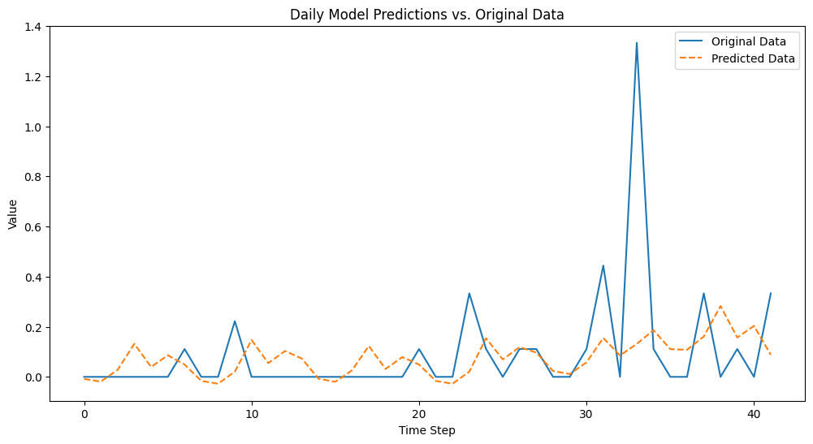
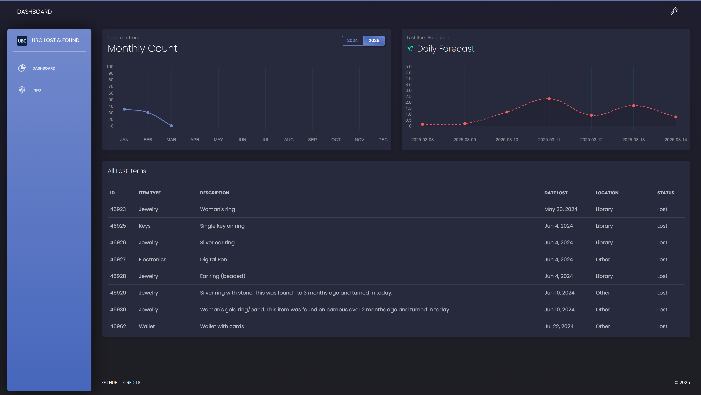

# UBC Lost and Found System Analysis and Forecasting


Access Services. Retrieved from <a href = "https://parking.ubc.ca/">UBC Parking</a> 

## Overview
This project explores the UBC Lost and Found system using a data-driven approach to uncover trends, improve operational efficiency, and provide actionable insights. By combining exploratory data analysis, time series forecasting models, and an interactive web dashboard, this project aims to provide recommendations to optimize storage allocation, improve item recovery, and enhance communication channels.

The findings highlight how forecasting models and exploratory data analysis can help design smarter, more proactive lost and found systems while also showcasing the broader applications of data science to operational challenges.

## Dataset
The [UBC Lost and Found database](https://lostandfound.ubc.ca/all-items) is a publicly accessible dataset containing information about items reported lost within the University of British Columbia campus. The dataset spans from May 2024 to the current day, with over 190 entries. Each entry includes details such as the item type, description, date lost, and location. The dataset retrieved as of February 2025 is used for the project.

## Key Features
### 1. Exploratory Data Analysis (EDA)
- **Commonly Lost Items**: Identified frequent categories, such as electronics and keys, highlighting the need for targeted solutions.
- **Temporal Patterns**: Discovered peak loss periods by analyzing weekday and monthly trends.
- **Location Trends**: Identified high-traffic areas, such as libraries, as hotspots for lost items.
- **NLP on Item Descriptions**: Used natural language processing to classify item descriptions into meaningful subcategories like wallets, accessories, and tech items.

### 2. Predictive Modeling
- **ARIMA Model**: Focused on linear trends and long-term forecasting, useful for aggregate resource planning.


  _ARIMA Weekly Forecast: Predicts weekly item loss trends based on historical data_


- **LSTM Model**: Captured nonlinear patterns and short-term dependencies, useful for dynamic daily forecasts.


  _LSTM Daily Forecast: Captures non-linear, short-term fluctuations in item loss patterns_
 

- **Model Comparison**: Highlighted trade-offs between simplicity (ARIMA) and flexibility (LSTM) for different forecasting needs. 

### 3. Interactive Web Dashboard
Developed a web dashboard using **Flask** (backend) and **Vue.js** (frontend) to visualize trends and forecast lost item volumes. The dashboard utilizes MySQL for structured data storage and optimized SQL queries for efficient retrieval of lost item records. This allows users to: 
- ✅ Explore temporal patterns and lost item trends through interactive **Vue Chart.js** visualizations.
- ✅ View real-time summary statistics of lost items across campus.
- ✅ Generate forecasts using machine learning models (LSTM) to predict future lost item patterns.
- ⬜️ Filter by item category, location, and time period for better decision-making.



### 4. Actionable Recommendations
- **Targeted Awareness Campaigns**: Suggested communication strategies to reduce losses during high-risk periods.
- **Optimized Storage Solutions**: Recommended resource allocation based on predicted item trends.
- **Enhanced Communication Platforms**: Proposed centralized reporting systems for better lost and found operations.

## Technical Details
- **Language**: Python 3.8+
- **Libraries**: pandas, matplotlib, numpy, seaborn, scikit-learn, statsmodels, NLTK, mglearn, spaCy, PyTorch
- **Web Development**: Flask, Vue.js, Vue Chart.js
- **Database**: MySQL
- **Models**: Time series forecasting using ARIMA and LSTM
- **Tools**: Jupyter Notebook, Git

## Project Structure
```markdown
UBC-Lost-and-Found-Predictive-Analysis/
├── .ipynb_checkpoints/  
├── .vscode/  
├── backend/                  # Flask backend for the web dashboard  
├── frontend/                 # Vue.js frontend for the web dashboard  
├── notebook/                 # Jupyter notebooks for data analysis and modeling  
├── .gitignore  
├── README.md  
├── fetch_data.py             # Script to fetch data  
├── requirements.txt          # Python dependencies  
```


## Installation
To run this project locally:

1. Clone the repository
   ```console
   git clone https://github.com/yourusername/UBC-Lost-and-Found-Predictive-Analysis.git  
   ```
2. Install dependencies:
   ```console
   pip install -r requirements.txt
   ```
3. Set up the database:
   - Import the `backend/db/database.sql` file into your MySQL server.
   - Update the database connection settings in `backend/config.py`
4. Run the Flask backend:
    ```console
   cd backend  
   python app.py  
    ```
5. Run the Vue.js frontend:
    ```console
   cd frontend  
   npm install  
   npm run serve  
    ```
6. Open the dashboard:
    - Once both the backend and frontend are running, open http://localhost:8080/ in your browser to interact with the dashboard.
7. Explore the Jupyter notebooks:
    - Open `notebook/notebook.ipynb` to view the comprehensive data analysis and modeling process.